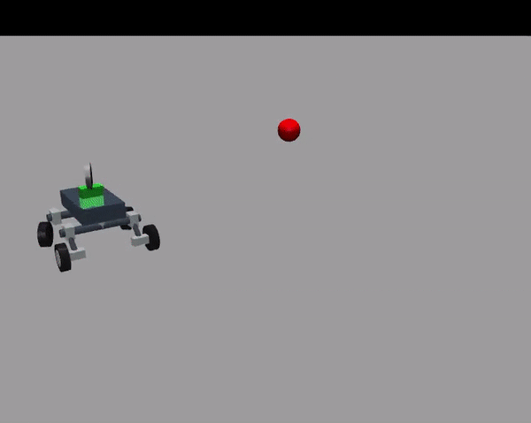

***********
Nengo and low-powered AI hardware for robust, embedded control
***********

This repository is supplementary material for the paper 'Nengo and low-powered AI hardware for robust, embedded control'.
The code for running the examples is provided here, as well as the scripts for regenerating the data analysis in Figure 2.

Installation
============

These instructions assume you are using `Anaconda <https://www.anaconda.com/products/individual>`_ to manage your Python environments, and have Git installed.

**NOTE** To run these examples on Loihi hardware you will need to adhere to the Loihi dependencies, including Python 3.5.2.
Installation instructions can be found at: https://www.nengo.ai/nengo-loihi/installation.html.
These examples can also be run using any other Nengo backend, including NengoLoihi's emulator.
If you are targetting any backend aside from the Loihi hardware, please install the most recent Python.

To install the dependencies, run::

    pip install -r requirements.txt

You will also need to install the latest versions of Nengo, NengoDL, NengoInterfaces,
and NengoLoihi::

    git clone https://github.com/nengo/nengo
    cd nengo
    pip install -e .
    cd ..

    git clone https://github.com/nengo/nengo-dl
    cd nengo-dl
    pip install -e .
    cd ..

    git clone https://github.com/nengo/nengo-loihi
    cd nengo-loihi
    pip install -e .
    cd ..

    git clone https://github.com/nengo/nengo-interfaces
    cd nengo_interfaces
    pip install -e .
    cd ..

Installation for Windows users
##############################

- Download the binaries for mujoco 2.1.0: https://github.com/deepmind/mujoco/releases/download/2.1.0/mujoco210-windows-x86_64.zip
- Extract the downloaded mujoco210 directory into ``C:\Users\your_user\.mujoco\mujoco210``
- Add the bin folder to your user PATH:
        Search box > Edit the System Environment Variables >Environment Variables
        Edit 'Path' variable on User variables
        New -> ``C:\Users\your_user\.mujoco\mujoco210\bin``
- Install ``mujoco-py`` library, a compatible version (this is NOT the custom library)::

        pip install mujoco-py==2.1.2.14
        
- Clone the repository, the last updated branch::

        git clone -b mausspaun https://github.com/studywolf/mujoco-py.git
        
- Find the folder ``mujoco_py`` and copy it to your python distribution packages folder, overwriting all the standard files with the custom files from the repository
        For Windows 10 users with Anaconda the standard folder is usually ``C:\Anaconda3\Lib\site-packages\mujoco_py\``
- Test your installation by running python on a terminal and importing the custom mujoco_py library::

    import mujoco_py
    
- Since the original files were manually overwritten, the library will compile again (only the first time you import it), and if no errors were reported, the installation is complete.

Examples
========

Example 1 - Neurorobotic rover perception and action
####################################################

You can either run the rover using pre-trained vision weights, or regenerate the data to train your own instance of the vision network and use those weights.

To run the rover using pre-trained weights
******************************************
::

    python rover.py

To train up your own set of weights
***********************************
Generate training and validation data
::

    python rover.py generate_data

The script samples every 10th frame, and is set to generate 45k training images and 5k for validation. This may take some time depending on your machine.

Train up the network
::

    python train_rover_vision.py

This will generate the weights file in the data folder. By default this will run for 50 epochs but convergence may occur before this.

Test the network to validate
::

    python rover_vision.py data/weights

Run using the rover
::

    python rover.py data/weights

Example 2 - Neurorobotic adaptive controller
############################################

You can see an example video of the adaptive controller running `here <https://www.youtube.com/watch?v=n9hGWbJhgLE>`_.

Figure 2 data analysis and generation
#####################################

To regenerate the figures from Figure 2, the neurorobotic adaptive controller example, you will first need to download the `dataset <https://drive.google.com/file/d/1Xi8XIVaCeSO4l-VUeUOQYR9RVZW5hUS5/view?usp=sharing>`_.
Once the dataset is downloaded to this folder, you can simply run::

    python plot_full.py

To run the analysis and generate the graphs in Figure 2 of the paper.
